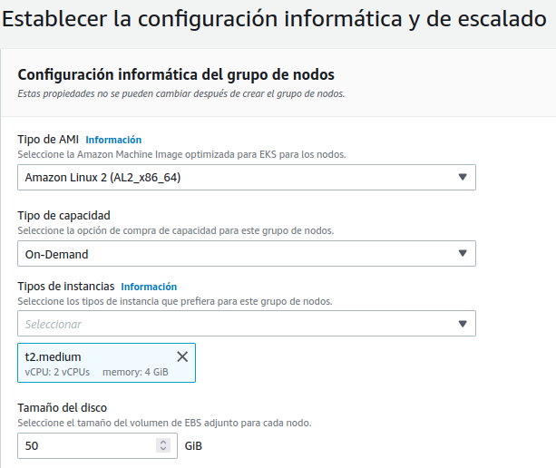
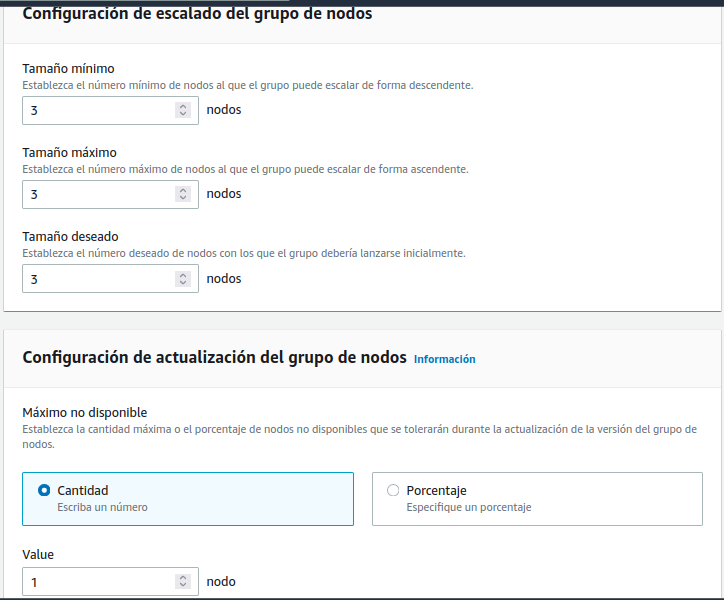
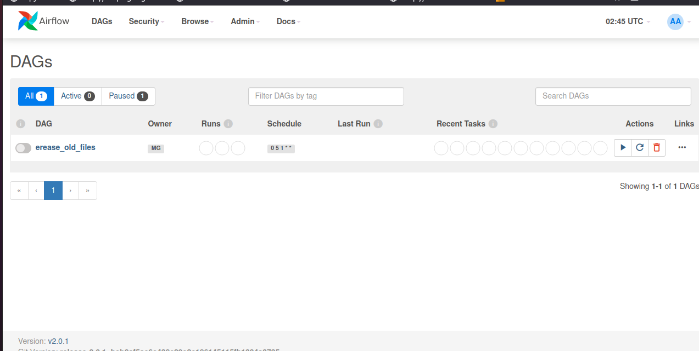
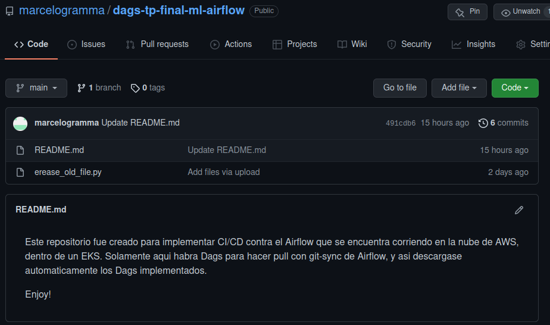
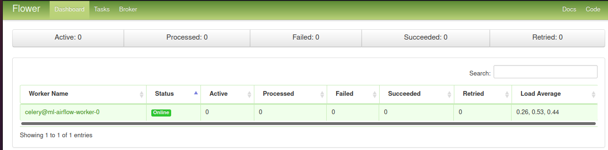

# Airflow ETL With EKS EFS & Sagemaker (en desarrollo) 
<p></p>

### Diagrama de la solución ###


[](/imgs/ML-TP_Final.drawio.png)

#### Importante ###
Si quiere subir esta app a algún repositorio, deberá primero instalar los hooks de pre-commit, así podrá tener una validación
Ejecute en el directorio raíz ```poetry install``` &  ```poetry run pre-commit install```
Esto tanto en el dir raíz de repo y también en el dir /Airflow-dags/github-dags

### Definición del problema planteado ###
<br></br>


#### Contexto: ####

Acaba de ser contratado como el primer ingeniero de datos de una pequeña empresa de viajes. Su primera tarea para usted fue demostrar el valor y los conocimientos que se pueden generar a partir de las canalizaciones de datos.
Su plan es que una vez que demuestre lo valiosos que pueden ser los datos, comenzarán a invertir en el uso de un proveedor de instancias en la nube. Por ahora, su propia computadora tendrá que hacerlo
.
#### Objetivo: ####

Crear un DAG de Airflow que actúe de ETL para extraer extraiga datos estáticos S3 y los cargue en una base de datos de Postgres. 

#### Datos a utilizar: ####

Para llevar a cabo el desarrollo se utilizará el dataset de demoras y cancelaciones de viajes aéreos de Kaggle que será hosteado en un bucket en S3. Lo primero será obtener los datos siguiendo estos pasos:

* Instalar el cliente de Kaggle: pip install kaggle.
* Instalar el cliente de aws siguiendo estas [instrucciones](https://docs.aws.amazon.com/cli/latest/userguide/getting-started-install.html) acorde a su sistema operativo.
* Instalar el cliente de aws eksctl siguiendo estas [instrucciones](https://docs.aws.amazon.com/eks/latest/userguide/eksctl.html) 
* Configurar las credenciales siguiendo estas [instrucciones](https://github.com/Kaggle/kaggle-api#api-credentials).
* Bajar datos de Kaggle:

 cd to your local directory
```cd /path/to/dataset/```
<br></br>
```$ mkdir -p minio/data/flights-bucket```
<br></br>
 Download zipped dataset from kaggle
```$ kaggle datasets download -d yuanyuwendymu/airline-delay-and-cancellation-data-2009-2018```
<br></br>
 Unzip files
``` $ unzip airline-delay-and-cancellation-data-2009-2018.zip -d raw/```
<br></br>
 Remove zipped data to save space
``` $ aws s3 sync raw/ s3://[ml-dataset-raw-s3]/raw/```
<br></br>
 Remove zipped data to save space [optional]
```$ rm airline-delay-and-cancellation-data-2009-2018.zip```

En este punto al correr el comando el siguiente comando debería aparecer un archivo CSV por año en el directorio de s3:
```aws s3 sync raw/ s3://[ml-dataset-raw-s3]/raw/```

<br></br>

#### Desarrollo: ####
1. Se configuro Airflow para que corra en AWS. Esto se puede hacer de varias maneras, pero aquí se desployo dentro de un cluster de kubernetes EKS. Se utilizo la herramienta git-sync para sincronizar los dags desde un repo CI/CD
2. Se creo una instancia RDS de Postgres. La misma es Multi-AZ y posee instancia de backup. Esta instancia será utilizada como DB en los puntos siguientes.
3. Se desarrollo un DAG de Airflow con schedule anual que:
<br></br>
○ Se calcula el promedio del tiempo de demora de salida (columna DEP_DELAY) por aeropuerto de salida (columna ORIGIN) y día.
<br></br>
○ Se utilizo un algoritmo de detección de anomalías para identificar por cada aeropuerto si hubo algún día con demoras fuera de lo normal.
<br></br>
○ Se utilizo los datos del punto anterior por cada aeropuerto para producir un gráfico desde Python usando Pandas o Matplotlib en el cual se pueda ver la cantidad de vuelos de cada día con alguna indicación en
los días que fueron considerados anómalos.
<br></br>
○ Se carga la data sumarizada junto con un indicador para la fila correspondiente de cada día para indicar si para ese día en un aeropuerto particular las demoras estuvieron fuera de lo esperable. Asimismo los gráficos generados anteriormente son almacenados en S3 en un path fácilmente identificable por año y aeropuerto analizado.
<br></br>
4. Se desarrollo una visualización de los datos cargados. Esto se puede hacer alternativamente de dos maneras (se realiza una de las dos):
○ Configurar Superset para que se levante utilizando Docker y muestre un dashboard. En caso de utilizar Docker o Docker Compose es necesario incluir instrucciones y archivos necesarios para llevar a cabo
la configuración.
<br></br>
○ Configurar un dashboard con el servicio AWS Quicksight. En este caso es necesario incluir en la documentación del proyecto los pasos requeridos para que el servicio quede operativo.
<br></br>
Notas:
- El DAG funciona para cualquiera de los años 2009 a 2018 incluidos en el dataset. Se tiene en cuenta que si se corre dos veces para el mismo año podría haber una duplicación de datos y se resolvió.

#### Pasos ####

Clonamos el repositorio de la siguiente manera:
```git clone https://github.com/marcelogramma/Airflow-ETL-With-EKS-EFS-Sagemaker.git```
y luego ingresamos al directorio clonado.

Nos dirigimos con nuestro navegador web a la consola de AWS. Una vez logueados, vamos al servicio de Cloudformation mediante el cual nos permitirá desployar la infraestructura de nuestra solución. Los yml que se utilizaran para desployar la infraestructura se encuentran en el dir /CloudFormation, los mismos son 4 archivos numerados que deben ir subiéndose uno a uno, cuando el anterior termine.
<br></br>
### Como desployar la infraestructura ##

Nos dirigimos a la herramienta CloudFormation
<br></br>
1- Sobre la izquierda, en el menú Crear pila, hacemos click en "con recursos nuevos (estándar)
<br></br>


<br></br>

2 - Seleccionamos Cargar un archivo de plantilla


3 - Seleccionamos el primer archivo del directorio /cloudformation (01-ML-Network.yml) y damos siguiente donde definiremos el nombre de nuestra pila y entorno


4 - Definimos etiquetas y rol, 


siguiente dos veces y crear


comenzado de esta manera la creación del stack de red. En este punto se crea la VPC, Subnets, Internet GW y tabla de ruteo necesario para la implementación. Aguardar que finalice el proceso y verificar que no haya errores


5 - Repetimos este procedimiento con dada uno de los 3 restantes archivos yaml numerados hasta el 04. Solamente se muestran imágenes con los parámetros a tener en cuenta en cada creación

6 - Seguimos con la creación del stack 02-ML-SG.yaml


siguiente


Crear pila
<br></br>

7 - Crear pila con el archivo 03-ML-S3.yaml (igual que el paso anterior, solo se muestran configuración necesarias, el resto son a elección)


7.1 - Desde la consola web de aws, dirigirnos en otra pestaña, al servicio S3


7.2 - Ingresar al bucket ml-airflow-s3, y crear la carpeta logs


7.3 - ingresar al bucket ml-dataset-raw-s3, y crear la carpeta raw


8 - En este punto repetimos lo mismo con el archivo 04-ML-RDS.yaml. Tener en cuenta de seleccionar las subnets correctas. (ML-Network Private Subnet ML 1 y ML 2)


Setear password recordable, username postgres y security groups, como  muestra la imagen


Configuraciones varias


Siguiente y luego crear. Este proceso demora aproximadamente unos 15 minutos en tener operativa la DB de postgres. Aguardar que termine completamente con resultado ok. Aproveche este tiempo para ondar en la infraestructura desplegada (VPC, subnets, SG, etc)


9 - En este punto crearemos nuestro cluster en EKS. Para esto dirigirse al servicio EKS desde la consola hacemos click en agregar nuevo cluser -> Crear


10 - Definimos el nombre del cluster, versión de kubernetes y role (probado con la versión 1.21) y damos siguiente


11 - Definimos la VPC, subnets (ML-Network Public Subnet ML 1 y ML 2) y el Secutiry Group ML-SG-EKSecurityGroup-xxxxxxxx


Luego dejamos todo por defecto asegurándonos que el acceso en este caso sea publico y le damos siguiente dos veces, revisamos y creamos. Este paso demora unos 20 minutos en tener el cluster activo
Mientras esto sucede, vamos a configurar la CLI para poder tener acceso al cluster desde la misma. Obtener los datos de aws_access_key_id, aws_secret_access_key y aws_session_token y pegar en el siguiente archivo, si no existe crearlo, 


Debería quedar similar a esta imagen.

Luego verificamos que este funcionando con el comando:

```$ eksctl get cluster```


12 - Una vez que el cluster este activo, pasáramos a la creación de los nodos, haciendo click en informática y luego en agregar grupo de nodos


Definimos un nombre y el rol, el resto por defecto y hacemos siguiente


Definimos el tipo de capacidad, la AMI y el tipo de instancia con su tamaño de disco



La cantidad de nodos para el escalado y siguiente



Dejamos seleccionadas las dos subnets que vienen (son las mismas que usa el control plane, no modificar) y el SG


SG


Siguiente y crear. Aguardamos que termine el proceso y queden los nodos activos. 

13 - Una vez que quede el grupo de nodos activos, configuraremos kubectl (como [instalar kubectl](https://kubernetes.io/es/docs/tasks/tools/install-kubectl/) ) para que opere el cluster desde la CLI. Para esto ejecutamos desde la consola
<br></br>
```$ aws eks update-kubeconfig --region us-east-1 --name ML-EKS```


y lo verificamos con ```$ kubectl get svc``` y ``` kubectl get nodes ```


14 - Ahora vamos a desployar el dashboard de kubernetes con el siguiente [tutorial](https://docs.aws.amazon.com/es_es/eks/latest/userguide/dashboard-tutorial.html), el cual no voy a explicar acá, ya que se va de contexto. Una vez que haya pasado este paso podrá ingresar al dashboard con este link [http://localhost:8001/api/v1/namespaces/kubernetes-dashboard/services/https:kubernetes-dashboard:/proxy/#!/login](http://localhost:8001/api/v1/namespaces/kubernetes-dashboard/services/https:kubernetes-dashboard:/proxy/#!/login) 

Donde podrá administrar por otro medio mas su cluster y vera algo similar a esta imagen


15 - Ahora desarrollaremos la implementación. de EFS en la nube, para ellos realice desde la terminal lo siguiente:
<br></br>
15.1 - ```$ kubectl apply -k "github.com/kubernetes-sigs/aws-efs-csi-driver/deploy/kubernetes/overlays/stable/ecr/?ref=release-1.1"```  Solo para regiones diferente a china y sin usar Fargate
<br></br>
15.2 - ```$ aws eks describe-cluster --name your_cluster_name --query "cluster.resourcesVpcConfig.vpcId" --output text```
<br></br>
15.3 - ```$ aws ec2 describe-vpcs --vpc-ids YOUR_VPC_ID --query "Vpcs[].CidrBlock" --output text ```
<br></br>
15.4 - ```$ aws ec2 create-security-group --description efs-ml-efs-sg --group-name efs-sg --vpc-id YOUR_VPC_ID```
<br></br>
15.5 - ```$ aws ec2 authorize-security-group-ingress --group-id sg-xxx --protocol tcp --port 2049 --cidr YOUR_VPC_CIDR```
<br></br>
15.6 - ```$ aws efs create-file-system --creation-token eks-efs```
<br></br>
15.7 - ```$ aws efs create-mount-target --file-system-id FileSystemId --subnet-id SubnetID --security-group sg-xxx``` (este punto deberá realizarlo dos veces, una por cada subnet)
<br></br>
En este punto tenemos creado el EFS en la nube y procederemos a utilizarlo dentro del cluster. Para esto debemos editar el archivo airflow-helm/efs-pvc.yml con el valor de nuestro fs en la clave server.


Para realizar este punto, desde la consola de aws, vamos al servicio EFS donde veremos el sistema de archivo recién creado


Y copiamos el ID del sistema de archivos al archivo de la imagen anterior. Guardamos el cambio y ejecutamos el siguiente comando

 ```$ kubectl apply -f efs-pvc.yml ```
 
 luego de que se aplique, podemos ver el deploy en el cluster con los siguientes comandos
 ```$ kubectl get pv``` y ``` $ kubectl get pv ```
 
 
 
 Aclaración, no se usara el FS, ya que requiere mas configuración y explicación y se va fuera de contexto y foco de lo pedido, solo se muestra como realizar su implementación. y deployarlo en el EKS.
 
 16 - Modificar el archivos airflow-helm/value.yml en la sección connections, con las key de acceso a la CLI
 
 
 
 También modificar por su repositorio de Github, donde implemente CI/CD para los dags
 
 
 
 17 - Luego de estas modificaciones, ejecutamos los siguientes comando
 
  ```$ kubectl apply -f airflow-db-secret.yml ``` , ```$ kubectl apply -f airflow-serviceAccount.yml ``` y ```$ helm install ml-airflow airflow-stable/airflow --versión 8.5.3 --values values.yml``` Nota. Debera tener instalado [HELM](https://helm.sh/docs/intro/install/) y ademas el repo [Helm Chart for Apache Airflow](https://artifacthub.io/packages/helm/apache-airflow/airflow) 
 
 Con este ultimo comando estamos ya desployando Apache Airflow en el cluster EKS, esto demora unos minutos, aguarde y verifique que el deploy se complete normalmente
 
Cuando helm termine, veremos este mensaje


Esto quiere decir que ya se desployo, pero para verificar que este ok, dirigirse al cluster en el servicio EKS y verificar las cargas de trabajo


Si todo esta ok, ejecutaremos los siguientes comandos

``` $ kubectl port-forward svc/ml-airflow-web 8080:8080 --namespace default > /dev/null &```

``` $ kubectl port-forward svc/ml-airflow-flower 5555:5555 --namespace default > /dev/null &```

El primero para ingresar a Airflow Web (user/pass admin admin) y el segundo al dash del flower 

Acá podemos ver el DAG que sincronizo desde GitHub





Y el home del flower




# CONTINUARA...
