# Airflow ETL With EKS EFS & Sagemaker 
<p></p>
[English version.](readme_eng.md).
### Diagrama de la solución ###


[](/imgs/ML-TP_Final.drawio.png)

#### Importante ###
Si quiere subir esta app a algún repositorio, deberá primero instalar los hooks de pre-commit, así podrá tener una validación
Ejecute en el directorio raíz ```poetry install``` &  ```poetry run pre-commit install```
Esto tanto en el dir raíz de repo y también en el dir /Airflow-dags/github-dags

### Definición del problema planteado ###
<br></br>


#### Contexto: ####

Acaba de ser contratado como el primer ingeniero de datos de una pequeña empresa de viajes. Su primera tarea para usted fue demostrar el valor y los conocimientos que se pueden generar a partir de las canalizaciones de datos.
Su plan es que una vez que demuestre lo valiosos que pueden ser los datos, comenzarán a invertir en el uso de un proveedor de instancias en la nube. Por ahora, su propia computadora tendrá que hacerlo
.
#### Objetivo: ####

Crear un DAG de Airflow que actúe de ETL para extraer extraiga datos estáticos S3 y los cargue en una base de datos de Postgres. 

#### Datos a utilizar: ####

Para llevar a cabo el desarrollo se utilizará el dataset de demoras y cancelaciones de viajes aéreos de Kaggle que será hosteado en un bucket en S3. Lo primero será obtener los datos siguiendo estos pasos:

* Instalar el cliente de Kaggle: pip install kaggle.
* Instalar el cliente de aws siguiendo estas [instrucciones](https://docs.aws.amazon.com/cli/latest/userguide/getting-started-install.html) acorde a su sistema operativo.
* Instalar el cliente de aws eksctl siguiendo estas [instrucciones](https://docs.aws.amazon.com/eks/latest/userguide/eksctl.html) 
* Configurar las credenciales siguiendo estas [instrucciones](https://github.com/Kaggle/kaggle-api#api-credentials).
* Bajar datos de Kaggle:

 cd to your local directory
```cd /path/to/dataset/```
<br></br>
```$ mkdir -p minio/data/flights-bucket```
<br></br>
 Download zipped dataset from kaggle
```$ kaggle datasets download -d yuanyuwendymu/airline-delay-and-cancellation-data-2009-2018```
<br></br>
 Unzip files
``` $ unzip airline-delay-and-cancellation-data-2009-2018.zip -d raw/```
<br></br>
 Remove zipped data to save space
``` $ aws s3 sync raw/ s3://ml-dataset-raw-s3/raw/```
<br></br>
 Remove zipped data to save space [optional]
```$ rm airline-delay-and-cancellation-data-2009-2018.zip```

En este punto al correr el comando el siguiente comando debería aparecer un archivo CSV por año en el directorio de s3:
```aws s3 sync raw/ s3://ml-dataset-raw-s3/raw/```

<br></br>

#### Desarrollo: ####
1. Se configuro Airflow para que corra en AWS. Esto se puede hacer de varias maneras, pero aquí se desployo dentro de un cluster de kubernetes EKS. Se utilizo la herramienta git-sync para sincronizar los dags desde un repo CI/CD
2. Se creo una instancia RDS de Postgres. La misma es Multi-AZ y posee instancia de backup. Esta instancia será utilizada como DB en los puntos siguientes.
3. Se desarrollo un DAG de Airflow con schedule anual que:
<br></br>
○ Se calcula el promedio del tiempo de demora de salida (columna DEP_DELAY) por aeropuerto de salida (columna ORIGIN) y día.
<br></br>
○ Se utilizo un algoritmo de detección de anomalías para identificar por cada aeropuerto si hubo algún día con demoras fuera de lo normal.
<br></br>
○ Se utilizo los datos del punto anterior por cada aeropuerto para producir un gráfico desde Python usando Pandas o Matplotlib en el cual se pueda ver la cantidad de vuelos de cada día con alguna indicación en
los días que fueron considerados anómalos.
<br></br>
○ Se carga la data sumarizada junto con un indicador para la fila correspondiente de cada día para indicar si para ese día en un aeropuerto particular las demoras estuvieron fuera de lo esperable. Asimismo los gráficos generados anteriormente son almacenados en S3 en un path fácilmente identificable por año y aeropuerto analizado.
<br></br>
4. Se desarrollo una visualización de los datos cargados. Esto se puede hacer alternativamente de dos maneras (se realiza una de las dos):
○ Configurar Superset para que se levante utilizando Docker y muestre un dashboard. En caso de utilizar Docker o Docker Compose es necesario incluir instrucciones y archivos necesarios para llevar a cabo
la configuración.
<br></br>
○ Configurar un dashboard con el servicio AWS Quicksight. En este caso es necesario incluir en la documentación del proyecto los pasos requeridos para que el servicio quede operativo.
<br></br>
Notas:
- El DAG funciona para cualquiera de los años 2009 a 2018 incluidos en el dataset. Se tiene en cuenta que si se corre dos veces para el mismo año podría haber una duplicación de datos y se resolvió.

#### Pasos ####

Clonamos el repositorio de la siguiente manera:
```git clone https://github.com/marcelogramma/Airflow-ETL-With-EKS-EFS-Sagemaker.git```
y luego ingresamos al directorio clonado.

Nos dirigimos con nuestro navegador web a la consola de AWS. Una vez logueados, vamos al servicio de Cloudformation mediante el cual nos permitirá desployar la infraestructura de nuestra solución. Los yml que se utilizaran para desployar la infraestructura se encuentran en el dir /CloudFormation, los mismos son 4 archivos numerados que deben ir subiéndose uno a uno, cuando el anterior termine.
<br></br>
### Como desployar la infraestructura ##

Nos dirigimos a la herramienta CloudFormation
<br></br>
1- Sobre la izquierda, en el menú Crear pila, hacemos click en "con recursos nuevos (estándar)
<br></br>

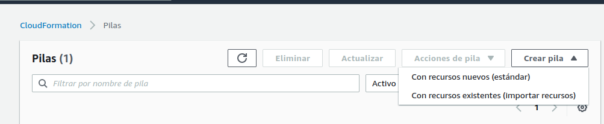
<br></br>

2 - Seleccionamos Cargar un archivo de plantilla


3 - Seleccionamos el primer archivo del directorio /cloudformation (01-ML-Network.yml) y damos siguiente donde definiremos el nombre de nuestra pila y entorno


4 - Definimos etiquetas y rol, 


siguiente dos veces y crear

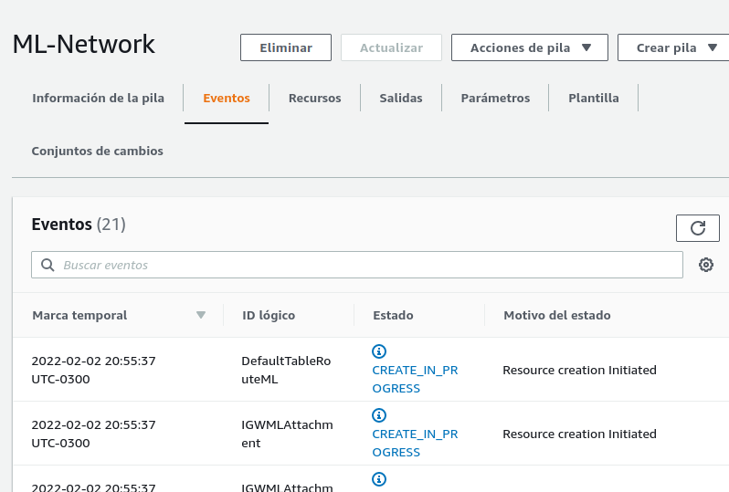

comenzado de esta manera la creación del stack de red. En este punto se crea la VPC, Subnets, Internet GW y tabla de ruteo necesario para la implementación. Aguardar que finalice el proceso y verificar que no haya errores

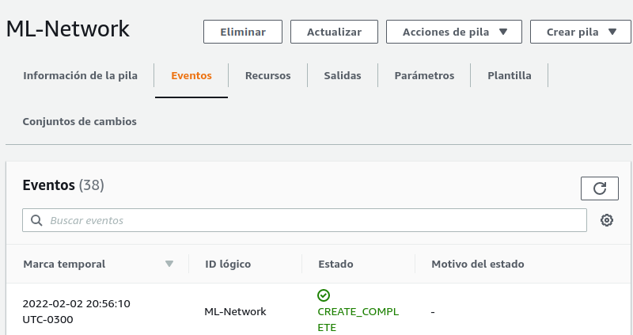

5 - Repetimos este procedimiento con dada uno de los 3 restantes archivos yaml numerados hasta el 04. Solamente se muestran imágenes con los parámetros a tener en cuenta en cada creación

6 - Seguimos con la creación del stack 02-ML-SG.yaml


siguiente

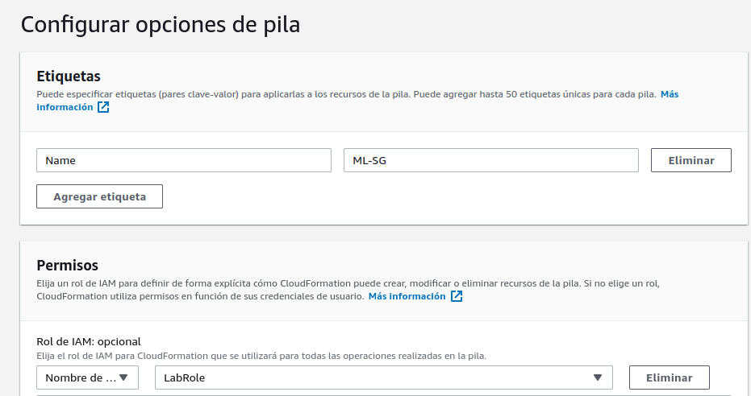

Crear pila
<br></br>

7 - Crear pila con el archivo 03-ML-S3.yaml (igual que el paso anterior, solo se muestran configuración necesarias, el resto son a elección)


7.1 - Desde la consola web de aws, dirigirnos en otra pestaña, al servicio S3

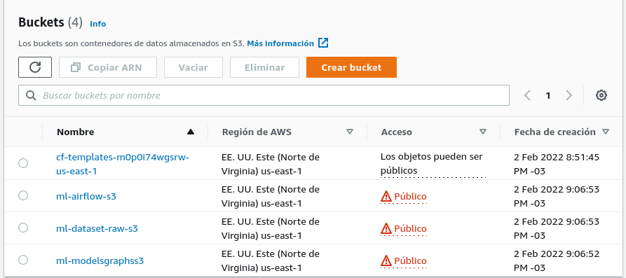

7.2 - Ingresar al bucket ml-airflow-s3, y crear la carpeta logs


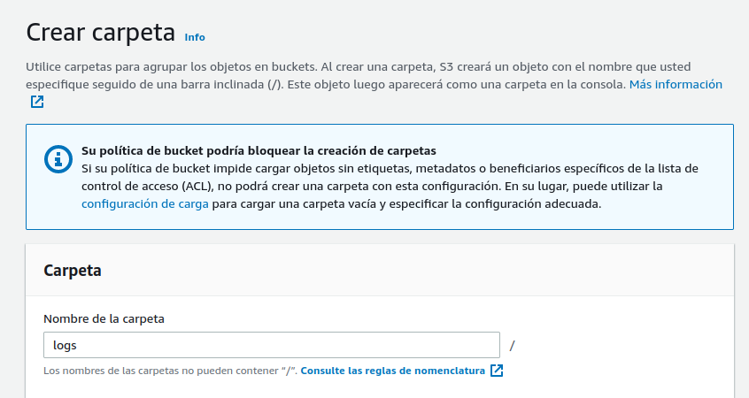

7.3 - ingresar al bucket ml-dataset-raw-s3, y crear la carpeta raw


7.4 - ingresar al bucket ml-dataset-raw-s3, y crear la carpeta raw-out


#### Importante ####
Debera crear un usuario para airflow y asignarle una politica de permisos que tenga acceso con privilegios al bucket de S3 donde se guardan los logs. Se puede seguir esta [guia](https://www.youtube.com/watch?v=DKsWEmoqwZY) . En este tutorial no se explica, ya que se usa una cuenta de laboratorio donde no se pueden crear usuarios, por eso, no se utiliza el Bucket S3 para guardar los logs
<br></br>

8 - En este punto repetimos lo mismo con el archivo 04-ML-RDS.yaml. Tener en cuenta de seleccionar las subnets correctas. (ML-Network Private Subnet ML 1 y ML 2)


Setear password recordable, username postgres y security groups, como  muestra la imagen

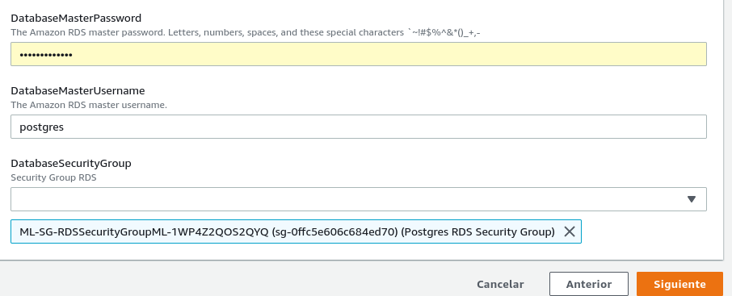

Configuraciones varias


Siguiente y luego crear. Este proceso demora aproximadamente unos 15 minutos en tener operativa la DB de postgres. Aguardar que termine completamente con resultado ok. Aproveche este tiempo para ondar en la infraestructura desplegada (VPC, subnets, SG, etc)


9 - En este punto crearemos nuestro cluster en EKS. Para esto dirigirse al servicio EKS desde la consola hacemos click en agregar nuevo cluser -> Crear

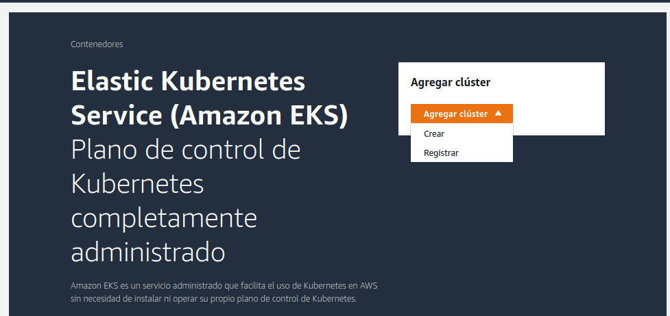

10 - Definimos el nombre del cluster, versión de kubernetes y role (probado con la versión 1.21) y damos siguiente

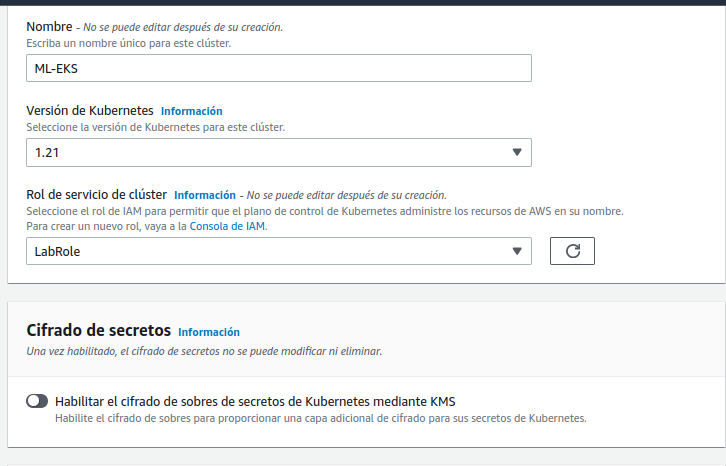

11 - Definimos la VPC, subnets (ML-Network Public Subnet ML 1 y ML 2) y el Secutiry Group ML-SG-EKSecurityGroup-xxxxxxxx


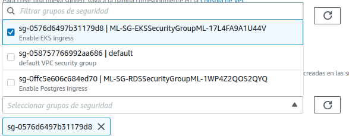

Luego dejamos todo por defecto asegurándonos que el acceso en este caso sea publico y le damos siguiente dos veces, revisamos y creamos. Este paso demora unos 20 minutos en tener el cluster activo
Mientras esto sucede, vamos a configurar la CLI para poder tener acceso al cluster desde la misma. Obtener los datos de aws_access_key_id, aws_secret_access_key y aws_session_token y pegar en el siguiente archivo, si no existe crearlo, 

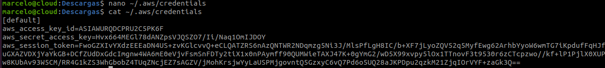

Debería quedar similar a esta imagen.

Luego verificamos que este funcionando con el comando:

```$ eksctl get cluster```


12 - Una vez que el cluster este activo, pasáramos a la creación de los nodos, haciendo click en informática y luego en agregar grupo de nodos

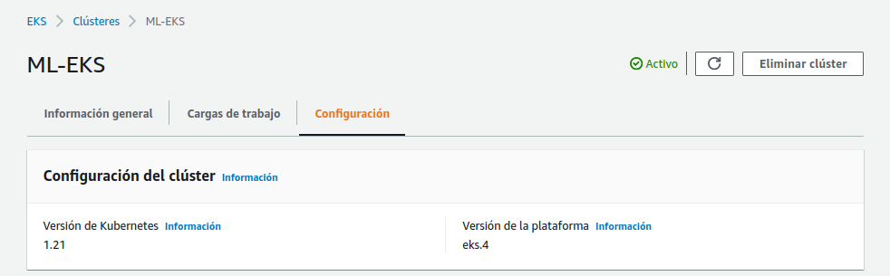

Definimos un nombre y el rol, el resto por defecto y hacemos siguiente

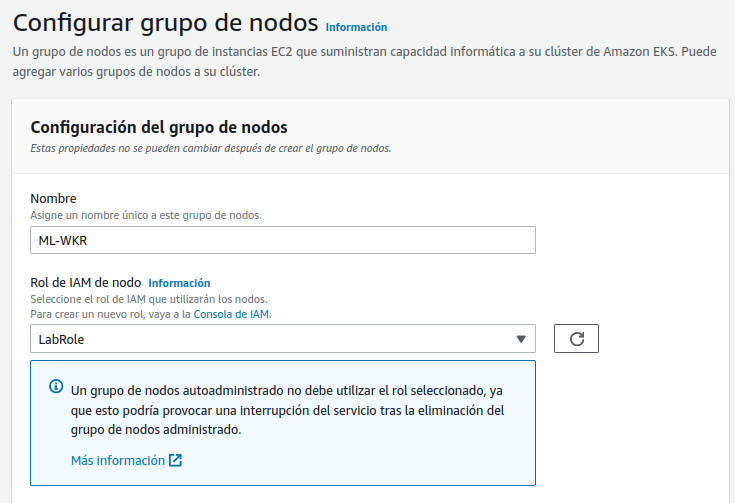

Definimos el tipo de capacidad, la AMI y el tipo de instancia con su tamaño de disco

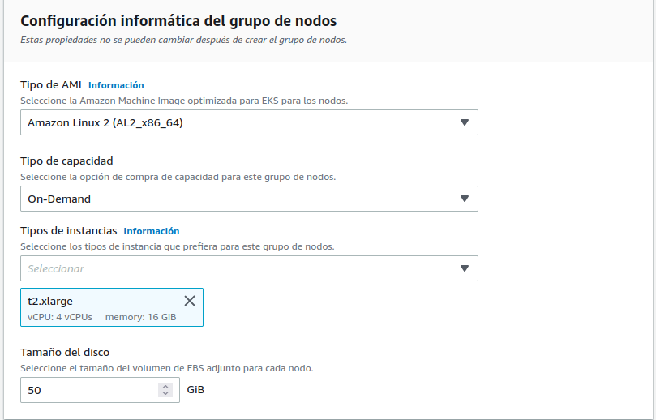

La cantidad de nodos para el escalado y siguiente

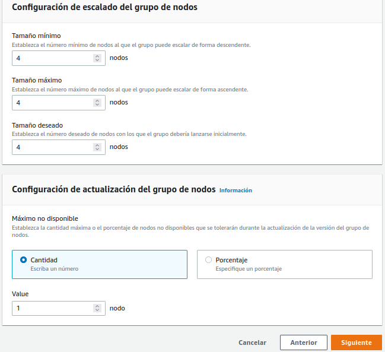

Dejamos seleccionadas las dos subnets que vienen (son las mismas que usa el control plane, no modificar) y el SG

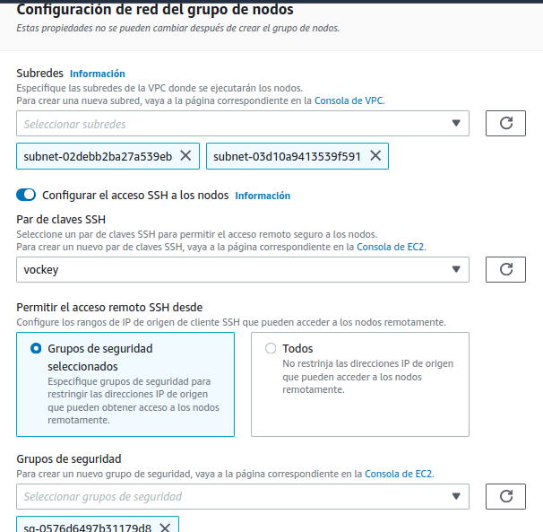

SG


Siguiente y crear. Aguardamos que termine el proceso y queden los nodos activos. 

13 - Una vez que quede el grupo de nodos activos, configuraremos kubectl (como [instalar kubectl](https://kubernetes.io/es/docs/tasks/tools/install-kubectl/) ) para que opere el cluster desde la CLI. Para esto ejecutamos desde la consola
<br></br>
```$ aws eks update-kubeconfig --region us-east-1 --name ML-EKS```


y lo verificamos con ```$ kubectl get svc``` y ``` kubectl get nodes ```


14 - Ahora vamos a desployar el dashboard de kubernetes con el siguiente [tutorial](https://docs.aws.amazon.com/es_es/eks/latest/userguide/dashboard-tutorial.html), el cual no voy a explicar acá, ya que se va de contexto. Una vez que haya pasado este paso podrá ingresar al dashboard con este link [http://localhost:8001/api/v1/namespaces/kubernetes-dashboard/services/https:kubernetes-dashboard:/proxy/#!/login](http://localhost:8001/api/v1/namespaces/kubernetes-dashboard/services/https:kubernetes-dashboard:/proxy/#!/login) 

Donde podrá administrar por otro medio mas su cluster y vera algo similar a esta imagen


15 - Ahora desarrollaremos la implementación. de EFS en la nube, para ellos realice desde la terminal lo siguiente:
<br></br>
15.1 - ```$ kubectl apply -k "github.com/kubernetes-sigs/aws-efs-csi-driver/deploy/kubernetes/overlays/stable/ecr/?ref=release-1.1"```  Solo para regiones diferente a china y sin usar Fargate
<br></br>
15.2 - ```$ aws eks describe-cluster --name your_cluster_name --query "cluster.resourcesVpcConfig.vpcId" --output text```
<br></br>
15.3 - ```$ aws ec2 describe-vpcs --vpc-ids YOUR_VPC_ID --query "Vpcs[].CidrBlock" --output text ```
<br></br>
15.4 - ```$ aws ec2 create-security-group --description efs-ml-efs-sg --group-name efs-sg --vpc-id YOUR_VPC_ID```
<br></br>
15.5 - ```$ aws ec2 authorize-security-group-ingress --group-id sg-xxx --protocol tcp --port 2049 --cidr YOUR_VPC_CIDR```
<br></br>
15.6 - ```$ aws efs create-file-system --creation-token eks-efs```
<br></br>
15.7 - ```$ aws efs create-mount-target --file-system-id FileSystemId --subnet-id SubnetID --security-group sg-xxx``` (este punto deberá realizarlo dos veces, una por cada subnet)
<br></br>
En este punto tenemos creado el EFS en la nube y procederemos a utilizarlo dentro del cluster. Para esto debemos editar el archivo airflow-helm/efs-pvc.yml con el valor de nuestro fs en la clave server.

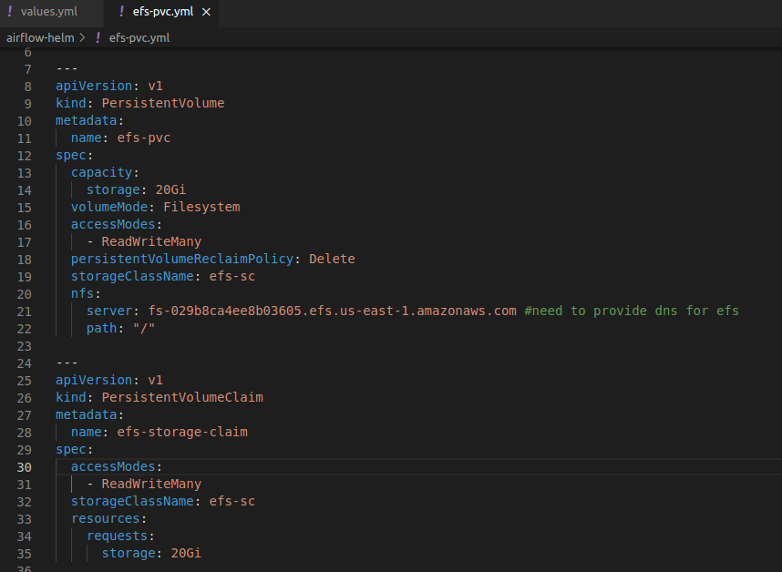

Para realizar este punto, desde la consola de aws, vamos al servicio EFS donde veremos el sistema de archivo recién creado


Y copiamos el ID del sistema de archivos al archivo de la imagen anterior. Guardamos el cambio y ejecutamos el siguiente comando

 ```$ kubectl apply -f efs-pvc.yml ```
 
 luego de que se aplique, podemos ver el deploy en el cluster con los siguientes comandos
 ```$ kubectl get pv``` y ``` $ kubectl get pv ```
 
 
 
 Aclaración, no se usara el FS, ya que requiere mas configuración y explicación y se va fuera de contexto y foco de lo pedido, solo se muestra como realizar su implementación. y deployarlo en el EKS.
 
 16 - Modificar el archivos airflow-helm/value.yml en la sección connections, con las key de acceso a la CLI
 
 
 
 También modificar por su repositorio de Github, donde implemente CI/CD para los dags
 
 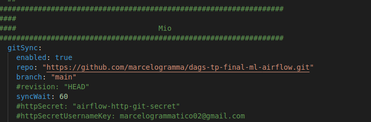
 
 17 - Luego de estas modificaciones, ejecutamos los siguientes comando
 
  ```$ kubectl apply -f airflow-db-secret.yml ``` , ```$ kubectl apply -f airflow-serviceAccount.yml ``` y ```$ helm install ml-airflow airflow-stable/airflow --versión 8.5.3 --values values.yml``` Nota. Debera tener instalado [HELM](https://helm.sh/docs/intro/install/) y ademas el repo [Helm Chart for Apache Airflow](https://artifacthub.io/packages/helm/apache-airflow/airflow) 
 
 Con este ultimo comando estamos ya desployando Apache Airflow en el cluster EKS, esto demora unos minutos, aguarde y verifique que el deploy se complete normalmente
 
Cuando helm termine, veremos este mensaje

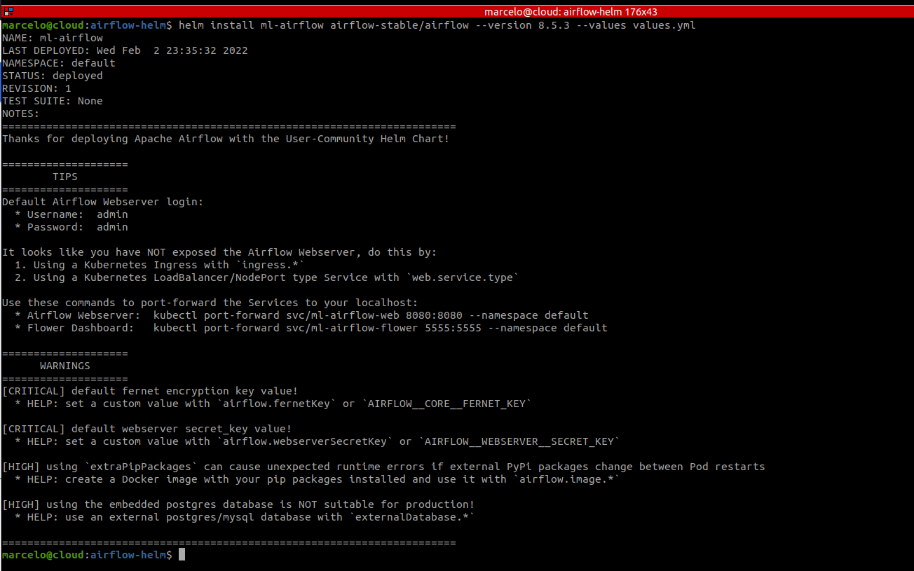

Esto quiere decir que ya se desployo, pero para verificar que este ok, dirigirse al cluster en el servicio EKS y verificar las cargas de trabajo


Si todo esta ok, ejecutaremos los siguientes comandos

``` $ kubectl port-forward svc/ml-airflow-web 8080:8080 --namespace default > /dev/null &```

``` $ kubectl port-forward svc/ml-airflow-flower 5555:5555 --namespace default > /dev/null &```

El primero para ingresar a Airflow Web (user/pass admin admin) y el segundo al dash del flower 

Acá podemos ver el DAG que sincronizo desde GitHub


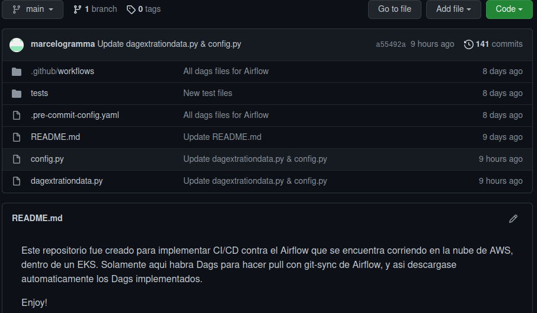

Y el home del flower

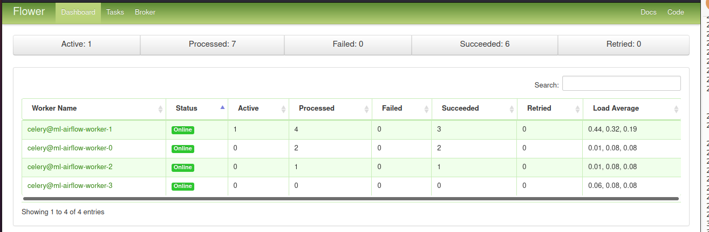

En este punto estamos ya capacitados para ejecutar el dag y asi obtener nuestro ETL ejecutado, donde en una primera instancia (E) se extrae la data desde los datasets alojados en el bucket de S3, esta estraccion se produce una por año para los años de los datasets. Luego de producirce la extraccion de los datos, tenemos la transformacion (T) donde solamente nos quedamos con la informacion del promedio del delay en las partidas por dia, por aeropuerto y año, para luego ser cargada (L) en la DB


Una vez que finalice este proceso, podremos ver las tablas creadas en la DB como asi tambien si queremos, explorar las mismas.
A su vez se crean archivos en el Bucket S3 en el directorio row-out/ archivos CSV con la misma informacion que se guardo en las tablas de postgres. Estos archivos son los utilizados por Sagemaker para producir y entrenar nuestro modelo de ML

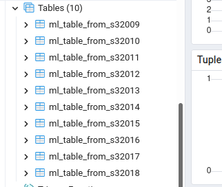

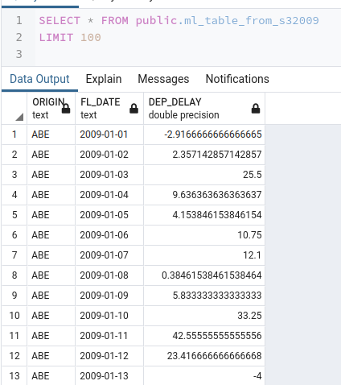

18 - En este punto nos dirigimos al servicio Sagemaker. Una vez en el panel, hacemos click en Abrir Sagemaker Studio

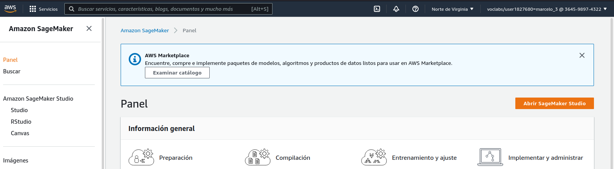

18.1 - Primero debemos configurar el dominio de Sagemaker, donde eligiremos un nombre para el perfil del usuario y dejaremos la configuracion rapida

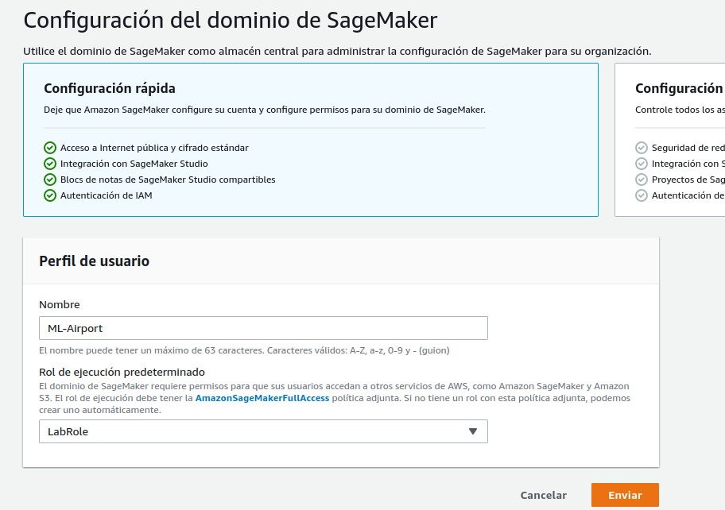

18.2 Elegimos nuestra VPC y las Subnets de la misma

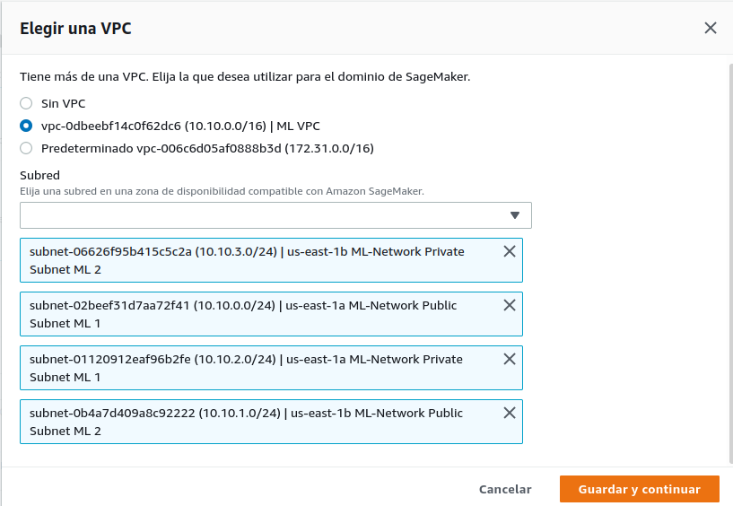

Y aguardamos que se termine de crear nuestro dominio de Sagemaker. Esto demora unos minutos. Finalmente esta disponible. Hacemos click en Lanzar aplicacion y luego en Studio


y aguaramos un minutos mas mientras se lanza el servidor de Jupiter Notebooks.

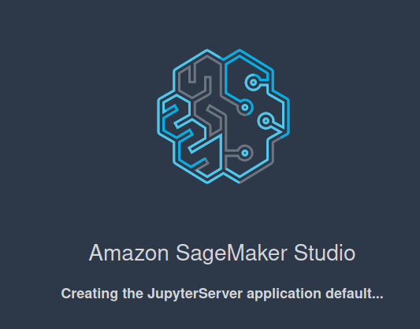

Una vez inicializado veremos un dashboar similar a este

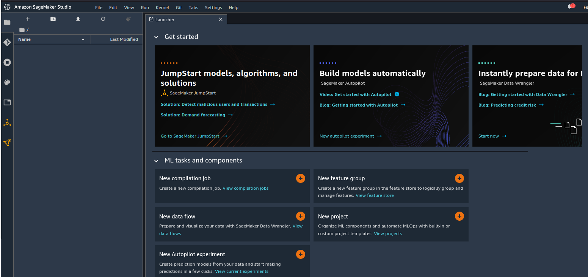

18.3 - En este punto debemos subir nuestra notebook y nuestro flow a Sagemaker. Los mismos se encuentra en el directorio notebooks/ y tambien creamos en el dominio el directorio from_s3


18.4 - (Aclaracion: debido al perfil de laboratorio que se uso, no fue posible entrenar el modelo, solo se hizo el modelo y se fiteo. Por perfil LAB -> error 413).
Por esto recien explicado, y como no podemos tener el dataset entrenado con los modelos tanto XGBoost y RCF, se crea un dataset, donde no estan los dias anomalos en el delay ni la prediccion, se crea un dataset con toda la data fiteada, para ser usado y demostrar como se usa y configura QuickSight
Lo primero que vamos a ejecutar va a ser el flow y la notebook Ml-Airport-01-XGBoost-v2. No se describen en este Readme, ya que tiene en la misma notebook celdas de Markdown donde se explica brevemente cada una. Al ejecutar la notebook, correr celda por cela desde la primera y esperando que la anterior finalice como asi tambien restarteando el kernel cada vez que sea solicitado. 

Aguardar que se cargue el flow y la notebook


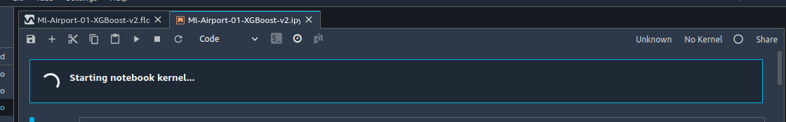

Una vez cargado, nos dirigimos al notebook y lo ejecutamos. Cuando realizamos el Job y la salida al S3, demorara unos cuantos minutos


Luego que finalice, continuamos corriendo las siguientes celdas.

### Nota: Si en la celda 13 tenemos un error "AttributeError: 'NoneType' object has no attribute 'items'" Es que hay que reiniciar el kernel por la instalacion del modulo del punto 12, pero podemos continuar asi"""

Podemos dirigirnos al dash de Sagemaker y navegar por el menu lateral donde podremos ver los trabajos de procesamiento, entrenamiento, inferencia, etc.


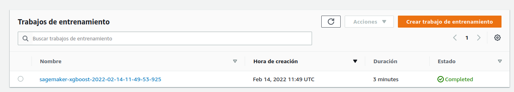

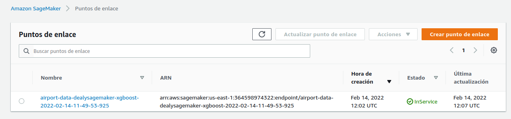

Luego de esto deberiamos seguir con el proceso de entrenamiento, pero debido a los permisos de lab, no podemos avanzar. La notebook no incluye la exportacion de la data a S3 ni a una DB. Si queremos continuar con troa notebook, podriamos correr la Ml-Airport-03-RandomCutForest, la cual incluye todo completo, hasta la carga de las imagenes en S3, pero por lo ya expuesto anteriormente (permisos) no se puede correr.

19 - QuickSight

#### Que es AWS QuickSght? ####

Amazon QuickSight permite que todos los miembros de su organización comprendan sus datos mediante preguntas en lenguaje natural, la exploración a través de paneles interactivos o la búsqueda automática de patrones y valores atípicos impulsada ​​por machine learning.

19.1 - Accedemos a QuickSight y si nunca lo hicimos, nos pedira que no loguiemos en el servicio


19.2 - Elegimos el tier Enterprise


19.3 completamos con la informacion solicitada

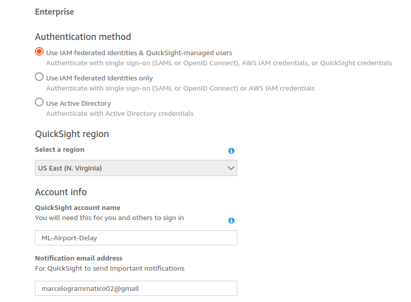


19.4 - Seleccionamos Amazon S3, donde esta el dataset terminado


Finalizar y esperamos


19.4 - En este punto debemos darle permisos a Quicksight para poder acceder al S3 y asignarle el rol. Para esto vamos al menu de la derecha arriba y seleccionamos Manage Quicksight


y luego a Security & permissions


Debemos verificar que tenga asignado un Rol que tenga acceso full a los recuros de S3. Si tiene que crear un Rol, primero cree un politica con permisos full al Bucket S3 donde se guardan los dataset, luego cree un Rol y asignele esa politica

19.4 - Luego de ingresar, sobre el menu lateral vamos a Datasets y luego a New datasets

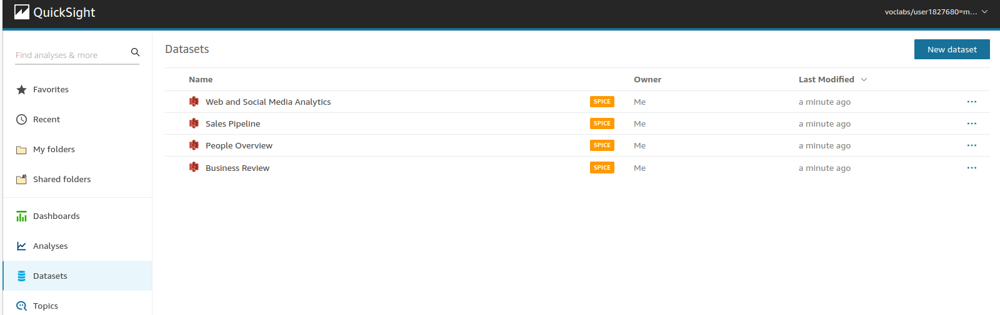

19.5 - En este punto seleccionamos nuestra fuente de datos, que es S3

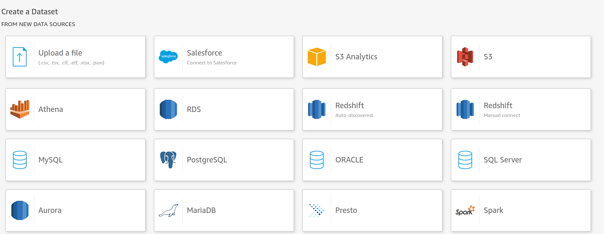

Nos va a pedir que le demos un nombre al source y tambien que subamos un manifiesto, donde se especifica la uri del bucket y del dataset. El manifiesto es similar a esto y se encuentra dentro del directorio notebooks


Lo subimos y connect

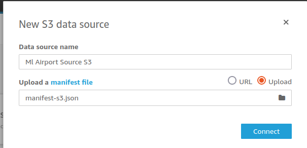


Tocamos en Visualize y estaremos en el dashboard de nuestro panel de graficos.

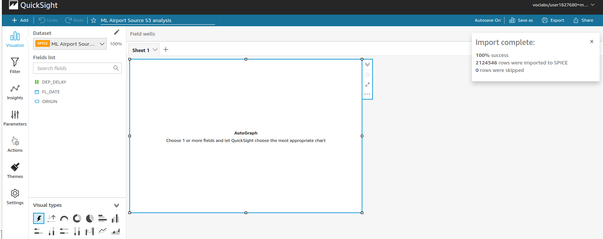

Aqui simplemente lo que queda es crear los graficos necesarios y solicitas por el negocio


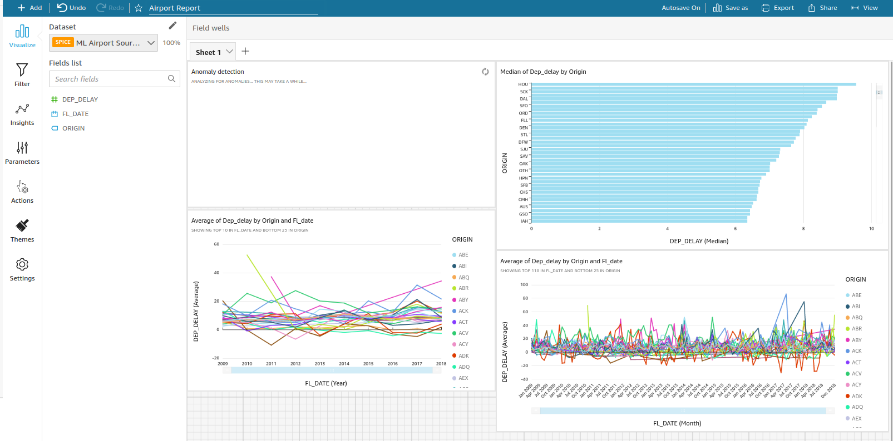

Estos son unas muestras de como quedaria. El grafico de las anomalias, al momento no cargo ya que tarda bastante en analizar el dataset


