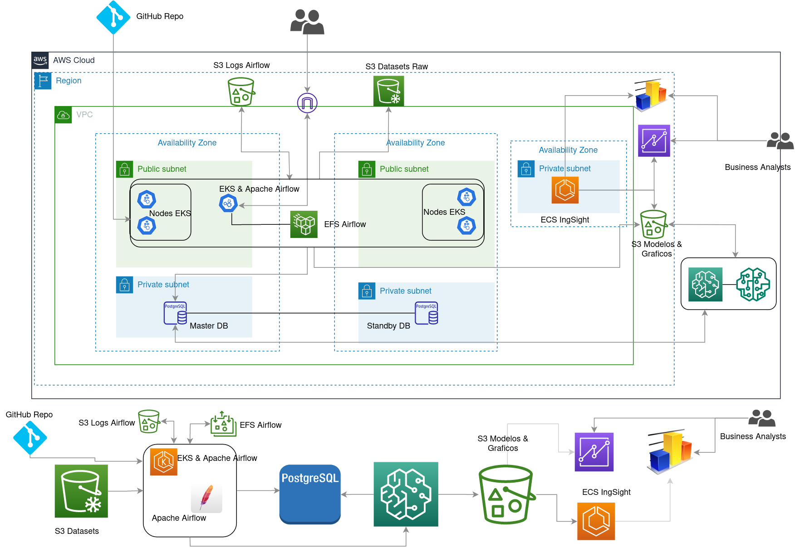
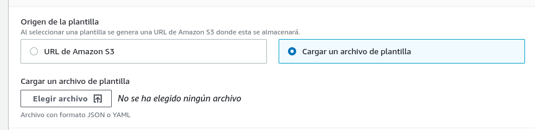

# Airflow ETL With EKS EFS & Sagemaker #
<p></p>

### Solution Diagram ###


[](/imgs/ML-TP_Final.drawio.png)

#### Important ###
If you want to upload this app to a repository, you must first install the pre-commit hooks, so you can have a validation
Run in the root directory ```poetry install``` & ```poetry run pre-commit install```
This both in the root dir of the repo and also in the /Airflow-dags/github-dags dir

### Definition of the problem posed ###
<br></br>


#### Context: ####

He has just been hired as the first data engineer for a small travel company. His first task for you was to demonstrate the value and insights that can be generated from data pipelines.
His plan is that once he proves how valuable data can be, they will start investing in using a cloud instance provider. For now, your own computer will have to do it
.
#### Target: ####

Create an Airflow DAG that acts as an ETL to extract static S3 data and load it into a Postgres database.

#### Data to use: ####

To carry out the development, the dataset of delays and cancellations of air travel from Kaggle will be used, which will be hosted in a bucket in S3. The first thing will be to obtain the data following these steps:

* Install the Kaggle client: pip install kaggle.
* Install the aws client by following these [instructions](https://docs.aws.amazon.com/cli/latest/userguide/getting-started-install.html) according to your operating system.
* Install the aws eksctl client by following these [instructions](https://docs.aws.amazon.com/eks/latest/userguide/eksctl.html)
* Configure credentials by following these [instructions](https://github.com/Kaggle/kaggle-api#api-credentials).
* Download data from Kaggle:

 cd to your local directory
```cd /path/to/dataset/```
<br></br>
```$ mkdir -p minio/data/flights-bucket```
<br></br>
 Download zipped dataset from kaggle
```$ kaggle datasets download -d yuanyuwendymu/airline-delay-and-cancellation-data-2009-2018```
<br></br>
 Unzip files
``` $ unzip airline-delay-and-cancellation-data-2009-2018.zip -d raw/```
<br></br>
 Remove zipped data to save space
``` $ aws s3 sync raw/ s3://ml-dataset-raw-s3/raw/```
<br></br>
 Remove zipped data to save space [optional]
```$ rm airline-delay-and-cancellation-data-2009-2018.zip```

At this point when running the command the following command should show up a CSV file per year in the s3 directory:
```aws s3 sync raw/ s3://ml-dataset-raw-s3/raw/```

<br></br>

#### Developing: ####
1. Airflow was configured to run on AWS. This can be done in several ways, but here it is deployed within a Kubernetes EKS cluster. Used the git-sync tool to sync dags from a CI/CD repo
2. An RDS Postgres instance was created. It is Multi-AZ and has a backup instance. This instance will be used as DB in the following points.
3. An Airflow DAG was developed with an annual schedule that:
<br></br>
○ The average departure delay time (DEP_DELAY column) is calculated per departure airport (ORIGIN column) and day.
<br></br>
○ An anomaly detection algorithm was used to identify for each airport if there were any days with unusual delays.
<br></br>
○ The data from the previous point was used for each airport to produce a graph from Python using Pandas or Matplotlib in which the number of flights each day can be seen with some indication in
the days that were considered abnormal.
<br></br>
○ The summary data is loaded along with an indicator for the corresponding row of each day to indicate if for that day at a particular airport the delays were outside of what was expected. Likewise, the previously generated graphs are stored in S3 in an easily identifiable path by year and airport analyzed.
<br></br>
4. A visualization of the loaded data was developed. This can be done alternatively in two ways (one of the two is done):
○ Configure Superset to get up using Docker and display a dashboard. In case of using Docker or Docker Compose, it is necessary to include instructions and files necessary to carry out
the configuration.
<br></br>
○ Set up a dashboard with the AWS Quicksight service. In this case, it is necessary to include in the project documentation the steps required for the service to be operational.
<br></br>
Grades:
- The DAG works for any of the years 2009 to 2018 included in the dataset. It is taken into account that if it is run twice for the same year there could be a duplication of data and it was resolved.
#### Pasos ####

We clone the repository as follows:
```git clone https://github.com/marcelogramma/Airflow-ETL-With-EKS-EFS-Sagemaker.git```
and then we enter the cloned directory.

We go with our web browser to the AWS console. Once logged in, we go to the Cloudformation service through which it will allow us to deploy the infrastructure of our solution. The yml that will be used to deploy the infrastructure are found in the /CloudFormation dir, they are 4 numbered files that must be uploaded one by one, when the previous one finishes.
<br></br>
### How to deploy the infrastructure ##

We turn to the CloudFormation tool
<br></br>
1- On the left, in the Create stack menu, we click on "with new resources (standard)
<br></br>


<br></br>

2 - Select Upload a template file



3 - We select the first file from the /cloudformation directory (01-ML-Network.yml) and click next where we will define the name of our stack and environment


4 - We define labels and role,


next twice and create


thus started the creation of the network stack. At this point, the VPC, Subnets, Internet GW and routing table necessary for the implementation are created. Wait for the process to finish and verify that there are no errors


5 - We repeat this procedure with one of the 3 remaining yaml files numbered up to 04. Only images with the parameters to be taken into account in each creation are shown

6 - We continue with the creation of the stack 02-ML-SG.yaml


Next


create stack
<br></br>

7 - Create stack with the 03-ML-S3.yaml file (same as the previous step, only necessary settings are shown, the rest are optional)


7.1 - From the aws web console, go to another tab, to the S3 service


7.2 - Enter the ml-airflow-s3 bucket, and create the logs folder


7.3 - enter the ml-dataset-raw-s3 bucket, and create the raw folder


7.4 - enter the ml-dataset-raw-s3 bucket, and create the raw-out folder


#### Important ####
You will need to create a user for airflow and assign a permissions policy that has privileged access to the S3 bucket where the logs are stored. You can follow this [guide](https://www.youtube.com/watch?v=DKsWEmoqwZY) . It is not explained in this tutorial, since a laboratory account is used where users cannot be created, therefore, the S3 Bucket is not used to save the logs
<br></br>

8 - At this point we repeat the same with the 04-ML-RDS.yaml file. Take into account to select the correct subnets. (ML-Network Private Subnet ML 1 and ML 2)


Set password rememberable, username postgres and security groups, as shown in the image


various configurations


Next and then create. This process takes approximately 15 minutes to have the Postgres DB operational. Wait for it to finish completely with ok result. Take advantage of this time to explore the deployed infrastructure (VPC, subnets, SG, etc.)


9 - At this point we will create our cluster in EKS. For this, go to the EKS service from the console, click on add new cluster -> Create


10 - We define the name of the cluster, version of kubernetes and role (tested with version 1.21) and we give the following


11 - We define the VPC, subnets (ML-Network Public Subnet ML 1 and ML 2) and the Security Group ML-SG-EKSecurityGroup-xxxxxxxx


Then we leave everything by default making sure that the access in this case is public and we give it following twice, review and create. This step takes about 20 minutes to have the cluster active
While this is happening, we are going to configure the CLI to be able to access the cluster from it. Get the data of aws_access_key_id, aws_secret_access_key and aws_session_token and paste in the following file, if it does not exist create it,


It should look similar to this image.

Then we verify that it is working with the command:

```$ eksctl get cluster```


12 - Once the cluster is active, we will proceed to the creation of the nodes, clicking on computing and then on adding group of nodes


We define a name and the role, the rest by default and press Next


We define the type of capacity, the AMI and the type of instance with its disk size


Nodes number for scaling and press Next


We leave selected the two subnets that come (they are the same ones used by the control plane, do not modify) and the SG


SG


Next and create. We wait for the process to finish and the active nodes remain.

13 - Once the group of nodes is active, we will configure kubectl (such as [install kubectl](https://kubernetes.io/es/docs/tasks/tools/install-kubectl/) ) to operate the cluster from the CLI. For this we execute from the console
<br></br>
```$ aws eks update-kubeconfig --region us-east-1 --name ML-EKS```


and we verify it with ```$ kubectl get svc``` and ``` kubectl get nodes ```


14 - Now we are going to deploy the Kubernetes dashboard with the following [tutorial](https://docs.aws.amazon.com/es_es/eks/latest/userguide/dashboard-tutorial.html), which I am not going to explain here, since it goes out of context. Once you have passed this step you will be able to access the dashboard with this link [http://localhost:8001/api/v1/namespaces/kubernetes-dashboard/services/https:kubernetes-dashboard:/proxy/#!/login]( http://localhost:8001/api/v1/namespaces/kubernetes-dashboard/services/https:kubernetes-dashboard:/proxy/#!/login)

Where you can manage your cluster by another means and you will see something similar to this image


15 - Now we will develop the implementation. of EFS in the cloud, for them do the following from the terminal:
<br></br>
15.1 - ```$ kubectl apply -k "github.com/kubernetes-sigs/aws-efs-csi-driver/deploy/kubernetes/overlays/stable/ecr/?ref=release-1.1"``` Regions only different from china and without using Fargate
<br></br>
15.2 - ```$ aws eks describe-cluster --name your_cluster_name --query "cluster.resourcesVpcConfig.vpcId" --output text```
<br></br>
15.3 - ```$ aws ec2 describe-vpcs --vpc-ids YOUR_VPC_ID --query "Vpcs[].CidrBlock" --output text ```
<br></br>
15.4 - ```$ aws ec2 create-security-group --description efs-ml-efs-sg --group-name efs-sg --vpc-id YOUR_VPC_ID```
<br></br>
15.5 - ```$ aws ec2 authorize-security-group-ingress --group-id sg-xxx --protocol tcp --port 2049 --cidr YOUR_VPC_CIDR```
<br></br>
15.6 - ```$ aws efs create-file-system --creation-token eks-efs```
<br></br>
15.7 - ```$ aws efs create-mount-target --file-system-id FileSystemId --subnet-id SubnetID --security-group sg-xxx``` (this point must be done twice, once for each subnet )
<br></br>
At this point we have created the EFS in the cloud and we will proceed to use it within the cluster. For this we must edit the airflow-helm/efs-pvc.yml file with the value of our fs in the server key.


To make this point, from the aws console, we go to the EFS service where we will see the newly created file system


And we copy the file system ID to the image file above. We save the change and execute the following command

 ```$ kubectl apply -f efs-pvc.yml ```
 
 after it is applied, we can see the deploy in the cluster with the following commands
 ```$ kubectl get pv``` and ``` $ kubectl get pv ```
 
 
 
 Clarification, the FS will not be used, since it requires more configuration and explanation and goes out of context and focus of what was requested, it only shows how to implement it. and deploy it to the EKS.
 
 16 - Modify the airflow-helm/value.yml file in the connections section, with the access keys to the CLI
 
 
 
 Also modify by your Github repository, where implement CI/CD for dags
 
 
 
 17 - After these modifications, we execute the following command
 
  ```$ kubectl apply -f airflow-db-secret.yml ``` , ```$ kubectl apply -f airflow-serviceAccount.yml ``` and ```$ helm install ml-airflow airflow-stable/airflow --version 8.5.3 --values ​​values.yml``` Note. You should have [HELM](https://helm.sh/docs/intro/install/) installed and also the [Helm Chart for Apache Airflow] repo(https://artifacthub.io/packages/helm/apache-airflow/ airflow)
 
 With this last command we are already deploying Apache Airflow in the EKS cluster, this takes a few minutes, wait and verify that the deploy is completed normally
 
When helm finishes, we will see this message


This means that it has already been deployed, but to verify that it is ok, go to the cluster in the EKS service and verify the workloads


If everything is ok, we will execute the following commands

``` $ kubectl port-forward svc/ml-airflow-web 8080:8080 --namespace default > /dev/null &```

``` $ kubectl port-forward svc/ml-airflow-flower 5555:5555 --namespace default > /dev/null &```

The first to enter Airflow Web (user/pass admin admin) and the second to the dash of the flower

Here we can see the DAG that I sync from GitHub


And the flower's home


At this point we are already able to execute the dag and thus obtain our executed ETL, where in a first instance (E) the data is extracted from the datasets hosted in the S3 bucket, this extraction occurs one per year for the years of the datasets. After producing the data extraction, we have the transformation (T) where we only keep the information of the average delay in the departures per day, per airport and year, to later be loaded (L) in the DB


Once this process is finished, we can see the tables created in the DB as well as, if we want, explore them.
In turn, files are created in the S3 Bucket in the directory row-out/ CSV files with the same information that was saved in the postgres tables. These files are the ones used by Sagemaker to produce and train our ML model.


18 - At this point we turn to the Sagemaker service. Once in the panel, we click on Open Sagemaker Studio


18.1 - First we must configure the Sagemaker domain, where we will choose a name for the user profile and we will leave the quick configuration


18.2 We choose our VPC and its Subnets


And we wait for our Sagemaker domain to be created. This takes a few minutes. It is finally available. We click on Launch application and then on Studio


and wait a few more minutes while the Jupiter Notebooks server is launched.


Once initialized we will see a dashboar similar to this


18.3 - At this point we must upload our notebook and our flow to Sagemaker. They are located in the notebooks/ directory and we also create the from_s3 directory in the domain


18.4 - (Clarification: due to the laboratory profile that was used, it was not possible to train the model, only the model was made and it was fitted. By LAB profile -> error 413).
For this reason just explained, and since we cannot have the dataset trained with both the XGBoost and RCF models, a dataset is created, where there are no abnormal days in the delay or the prediction, a dataset is created with all the fitted data, to be used and demonstrate how to use and configure QuickSight
The first thing we are going to run is going to be the flow and the Ml-Airport-01-XGBoost-v2 notebook. They are not described in this Readme, since it has Markdown cells in the same notebook where each one is briefly explained. When executing the notebook, run cell by cell from the first one and waiting for the previous one to finish as well as restarting the kernel every time it is requested.

Wait for the flow and the notebook to load


Once loaded, we go to the notebook and run it. When we carry out the Job and the output to S3, it will take a few minutes


After it finishes, we continue running the next cells.

### Note: If in cell 13 we have an error "AttributeError: 'NoneType' object has no attribute 'items'" It means that we have to restart the kernel by installing the module from point 12, but we can continue like this"""

We can go to the Sagemaker dash and navigate to the side menu where we can see the processing, training, inference, etc. jobs.


After this we should continue with the training process, but due to lab permissions, we can't move forward. The notebook does not include data export to S3 or to a DB. If we want to continue with another notebook, we could run the Ml-Airport-03-RandomCutForest, which includes everything complete, up to the loading of the images in S3, but due to what was previously stated (permissions) it cannot be run.

19 - QuickSight

#### What is AWS QuickSight? ####

Amazon QuickSight enables everyone in your organization to understand your data by asking natural language questions, exploring through interactive dashboards, or automatically searching for patterns and outliers powered by machine learning.

19.1 - We access QuickSight and if we never did, it will ask us not to log in to the service


19.2 - We choose the Enterprise tier


19.3 we complete with the requested information


19.4 - We select Amazon S3, where the finished dataset is


finish and wait


19.4 - At this point we must give permissions to Quicksight to access S3 and assign the role. For this we go to the menu on the right above and select Manage Quicksight


and then to Security & permissions


We must verify that it is assigned a Role that has full access to S3 resources. If you have to create a Role, first create a policy with full permissions to the S3 Bucket where the datasets are stored, then create a Role and assign that policy

19.4 - After entering, on the side menu we go to Datasets and then to New datasets


19.5 - At this point we select our data source, which is S3


It will ask us to give the source a name and also to upload a manifest, where the bucket and dataset uri are specified. The manifest looks similar to this and is located inside the notebooks directory


We upload it and connect


We touch on Visualize and we will be in the dashboard of our graphics panel.


Here simply what remains is to create the necessary graphics and request for the business


These are some samples of how it would look. The graph of the anomalies, at the moment I do not load since it takes a long time to analyze the dataset

